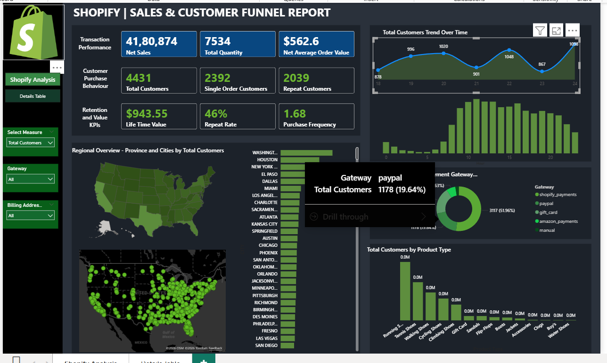
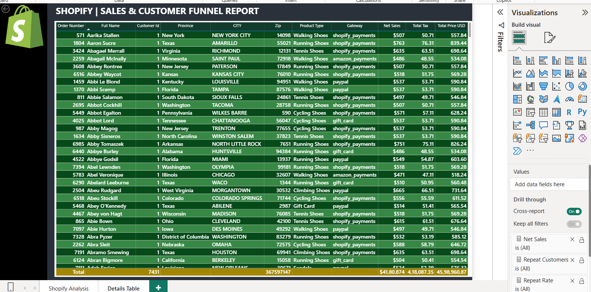

# Shopify Sales & Customer Funnel Dashboard | Power BI

## Overview
This project is an interactive Power BI dashboard built to analyse Shopify sales performance, customer behaviour, and repeat purchase trends. It provides a clear view of revenue, customer retention, regional performance, and product-level insights to support better business decision-making.

## Project File
- `Shopify Analysis.pbix` – main Power BI dashboard file

## Objectives
The dashboard was created to help answer key business questions such as:
- How is overall sales performance trending?
- How many customers are one-time buyers versus repeat customers?
- Which regions generate the highest sales?
- Which product types contribute the most to revenue?
- Which payment gateways are most commonly used?
- How do sales vary by day and hour?

## Key Features
- Net Sales KPI
- Total Quantity Sold
- Net Average Order Value
- Total Customers
- Single Order Customers
- Repeat Customers
- Lifetime Value
- Repeat Rate
- Purchase Frequency
- Regional sales analysis
- Sales by day
- Sales by hour
- Product type analysis
- Payment gateway analysis

## Dashboard Pages

### 1. Shopify Analysis
The main dashboard page presents KPI cards, customer funnel metrics, geographic sales insights, daily and hourly sales trends, and breakdowns by product type and payment gateway. It is designed to give a quick but detailed overview of business performance.

### 2. Details Table
This page provides a detailed transactional view including order number, customer ID, province, city, product type, payment gateway, tax, and total price. It supports deeper analysis and validation of the summary-level dashboard insights.

## Tools & Technologies Used
- Power BI Desktop
- DAX
- Data Modelling
- Data Visualisation

## Skills Demonstrated
- Sales performance analysis
- Customer retention analysis
- KPI reporting
- Dashboard design
- Geographic analysis
- Trend analysis
- Business insight generation

## Business Value
This dashboard helps businesses monitor sales performance, understand customer retention behaviour, identify repeat purchase trends, and evaluate geographic and product-level performance for data-driven decision-making.

## How to Use
1. Download the `.pbix` file from this repository.
2. Open it in Power BI Desktop.
3. Explore the dashboard pages and use filters to analyse sales and customer trends.

## Author
Suprobaha Chowdhury

## Screenshots

### Main Dashboard

### Details Table

